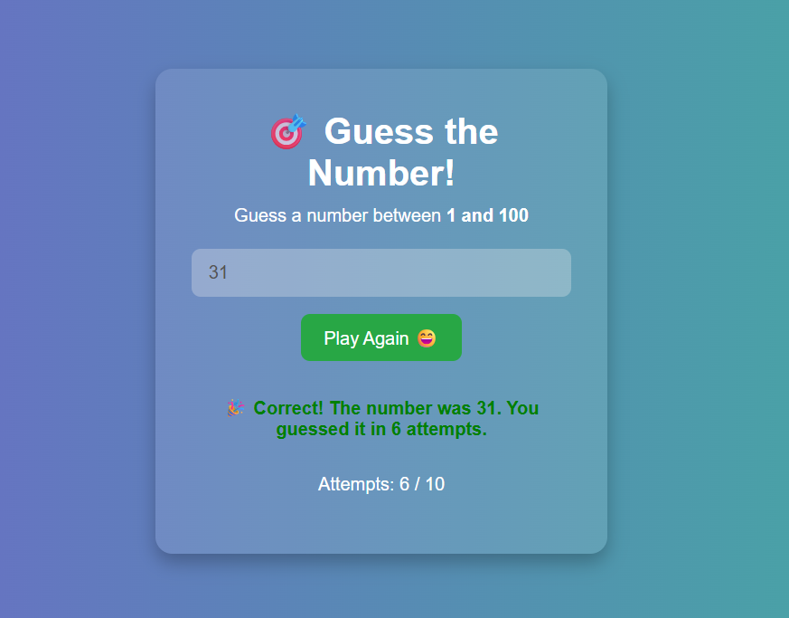

# 🎯 Guess The Number - JavaScript Game

A simple, interactive number guessing game built using **HTML**, **CSS**, and **JavaScript**. The user must guess a random number between **1 and 100** in **10 attempts or fewer**.

---

## 📸 Screenshot



---

## 🔗 Live Demo

[Play the Game Online](https://sai-veerendra.github.io/Guess-The-Number/)

---

## 🛠️ Features

- 🎲 Generates a random number from 1 to 100
- 👨‍💻 Input validation for empty and out-of-range values
- ✅ Real-time feedback: Too high, too low, correct!
- 🔄 Reset button to restart the game at any time
- 🎮 "Play Again" option when the game ends
- 💡 Clean, responsive UI with gradient background

---

## 🧠 Tech Stack

- **HTML5** – Structure of the game
- **CSS3** – Styling and responsiveness
- **JavaScript** – Core game logic and interactivity

---

## 📁 Folder Structure

```
guess-the-number/
│
├── index.html # Main game UI
├── resources/
│ ├── style.css # Styling file
│ ├── script.js # Game logic (JavaScript)
│ └── images/
│ └── image.png # Favicon or screenshot image
```

---

## 🚀 Getting Started

To run this project locally:

1. **Clone the repository**
   ```bash
   git clone https://github.com/Sai-Veerendra/Guess-The-Number.git
2. **Navigate to the folder**
   ```bash
   cd Guess-The-Number
3. **Open index.html in your browser**
   Or launch with Live Server in VS Code.

---

## 🙌 Acknowledgements

Built for learning and fun using core web development skills.
Inspired by beginner-friendly logic and clean UI design.

---

## 📜 License

This project is open source and free to use.

---

## 👨‍💻 Author

**Sai Veerendra Kotipalli**

- 📧 Email: [saiveerendrakotipalli@gmail.com](mailto:saiveerendrakotipalli@gmail.com)
- 💼 LinkedIn: [www.linkedin.com/in/sai-veerendra-kotipalli-31969b247](https://www.linkedin.com/in/sai-veerendra-kotipalli-31969b247/)
- 🐙 GitHub: [@Sai-Veerendra](https://github.com/Sai-Veerendra)
